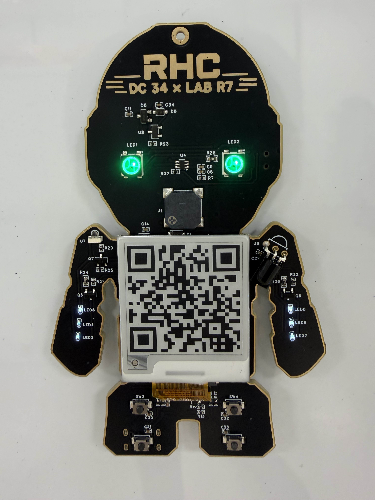
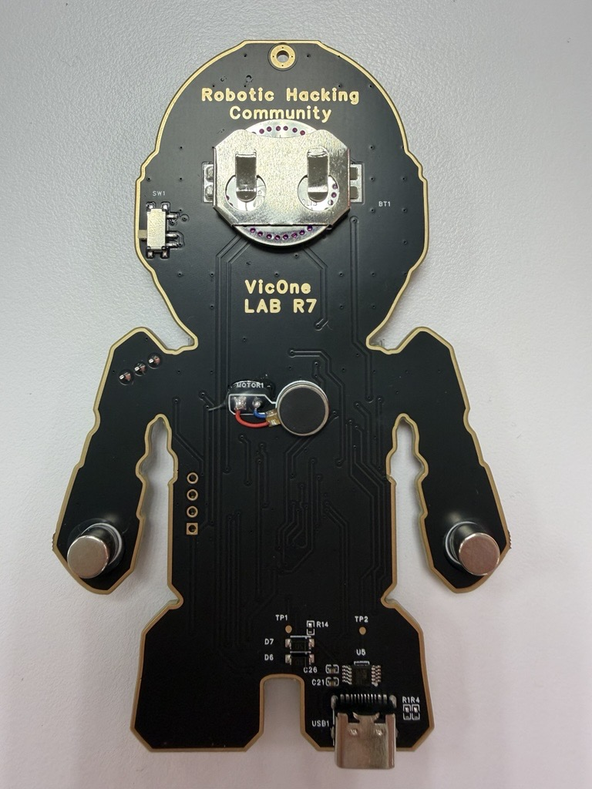

# RHC Badge Firmware

The unified firmware for the **Robotic Hacking Community (RHC)** DEF CON badge. It
combines an on-device menu UI on the e-paper display, an RGB "eye" LED engine,
badge-to-badge infrared interaction, a set of on-badge CTF challenges, and a
full **AI Interactive Mode** that hands the badge to a host AI over the USB-serial
link using a line-based JSON protocol.

<p align="center">
  
  
</p>

- **Firmware version:** `2.0.0`
- **MCU:** STMicroelectronics **STM32U073CBT6** (LQFP48, Cortex-M0+, `GENERIC_U073CBTX`)
- **Toolchain:** Arduino (Arduino core for STM32 / STM32duino)
- **Main sketch:** `rhc_badge/rhc_badge.ino`

---

## Table of contents

- [Hardware](#hardware)
- [Building & Flashing](#building--flashing)
- [Patching Adafruit NeoPixel](#patching-adafruit-neopixel-ws2812b-first-pixel-fix)
- [Features](#features)
- [Menu & Buttons](#menu--buttons)
- [AI Interactive Mode (serial protocol)](#ai-interactive-mode-serial-protocol)
- [CTF Challenges](#ctf-challenges)
- [Power management](#power-management)
- [Unlocking RDP (Readout Protection)](#unlocking-rdp-readout-protection)
- [Source layout](#source-layout)

---

## Hardware

### Pin map (STM32U073CBT6, LQFP48)

| Function                   | Pin    |
|----------------------------|--------|
| Buzzer PWM                 | `PB0`  |
| IR emitter (NEC TX)        | `PB1`  |
| Vibration motor PWM        | `PB3`  |
| Arm backlight LED PWM      | `PB4`  |
| Eye WS2812 data            | `PB5`  |
| IR receiver (NEC RX)       | `PB11` |
| Button 1 — UP              | `PB12` |
| Button 2 — DOWN            | `PB13` |
| Button 3 — SELECT          | `PB14` |
| Button 4 — CANCEL / BACK   | `PB15` |
| Debug / AI UART RX         | `PA3`  |
| Debug / AI UART TX         | `PA2`  |
| E-paper display            | SPI    |

- **Eyes** are 2× WS2812 LEDs on `PB5` (the early prototype used `PB2`).
- **IR receiver** is a TSOP38438; the buzzer / motor / IR emitter / arm LED are all
  driven through switching transistors on the PCB.
- **Buttons** are active-low with internal pull-ups (`INPUT_PULLUP`), debounced (50 ms).
- **E-paper** is a 1.54" 200×200 monochrome bistable panel (`epd1in54_V2`); the
  framebuffer (`uiBuffer`, 5000 bytes) is the source of truth and is pushed with
  fast flash-free partial updates during menu navigation.
- **UART** runs over CH340 USB-serial at **115200 baud** and carries both boot/log
  events and the AI control protocol.

### Unique ID

The STM32U073 96-bit unique device ID (`UID_BASE = 0x1FFF6E50`) is folded to an
8-byte serial via FNV-1a and embedded in the CTF registration QR code.

---

## Building & Flashing

### SWD programming header

The badge is programmed over **SWD** with an **ST-LINK**. The SWD pads are on the
**back of the badge, on the left side of the body**, in a single vertical column.
From **top to bottom**:

| Order (top → bottom) | Signal  |
|----------------------|---------|
| 1                    | `GND`   |
| 2                    | `SWCLK` |
| 3                    | `SWDIO` |
| 4                    | `+3V`   |

Wire these to the matching pins on an ST-LINK (V2/V3), then flash with the Arduino
IDE, `arduino-cli`, or STM32CubeProgrammer.

### Building from source

1. Install the **Arduino IDE** (or `arduino-cli`) with the **STM32 core**
   (STM32duino).
2. Select the board: **Generic STM32U0 series**, variant **`GENERIC_U073CBTX`**.
3. Install the required libraries:
   - **Adafruit NeoPixel** — WS2812 eye LEDs
   - **Arduino-IRremote** (4.x) — NEC send/receive
   - **QRCode** (ricmoo `qrcode.h`) — CTF registration / flag QR codes
4. Open `rhc_badge/rhc_badge.ino` and compile/upload over SWD or the built-in
   bootloader.

> **Adafruit NeoPixel needs a one-line patch** — see
> [Patching Adafruit NeoPixel](#patching-adafruit-neopixel-ws2812b-first-pixel-fix)
> below. Without it the first (left-eye) WS2812B latches a stuck random colour.

### Patching Adafruit NeoPixel (WS2812B first-pixel fix)

The WS2812B-V6 eyes need a small patch to **Adafruit NeoPixel 1.15.5**'s STM32
bit-bang path. Without it the **first LED in the chain (left eye)** latches a
stuck random colour at power-up (usually green/blue) and can't be turned off,
because the first data pulse is emitted slightly distorted and misread as a `1`
on the green MSB. (Downstream LEDs re-shape the signal, so only the first is
affected.)

**Fix:** hold the data line low and align to a SysTick reload boundary for
~20 µs before the first bit. Edit the *installed* library file
`…/Arduino/libraries/Adafruit_NeoPixel/Adafruit_NeoPixel.cpp`, in the STM32
800 kHz section (the `ARDUINO_ARCH_STM32` block, ~line 2882) right after
`SysTick->VAL = 0;` and before `for (;;) {`, insert:

```cpp
    // WS2812B-V6 first-pixel workaround: force data LOW for ~20us (16 bit
    // periods) and align the first rising edge to a reload boundary, so the
    // first pulse width isn't distorted and the first pixel latches correctly.
    LL_GPIO_ResetOutputPin(gpioPort, gpioPin);
    for (uint8_t w = 0; w < 16; w++) {
      while (SysTick->VAL > t0) ;
      while (SysTick->VAL <= t0) ;
    }
```

Notes:
- The patch lives in the **installed library dir** and is **wiped by a library
  update** — re-apply it (search the file for `first-pixel workaround` to check
  it's present). After patching you must **recompile and reflash** the badge.
- Quick verify: an all-off frame turns both eyes fully off, and commanding blue
  on the left eye shows pure blue (not cyan).
- If the first LED lights on its own during a data-free power-up window, that LED
  is genuinely damaged — run that test before reaching for the soldering iron.

### Flashing the prebuilt binary

A prebuilt image of the **initial release** is included as `rhc_badge.ino.bin`, so
you can flash the badge without building from source. Load it at the flash base
address (`0x08000000`) with STM32CubeProgrammer over SWD:

```sh
STM32_Programmer_CLI -c port=SWD mode=HOTPLUG -d rhc_badge.ino.bin 0x08000000 -v
```

> If the target still has RDP Level 1 enabled, unlock it first — see
> [Unlocking RDP](#unlocking-rdp-readout-protection). Programming a fresh `.bin`
> does **not** by itself clear readout protection.

### Build-time feature switches

Defined near the top of `rhc_badge/rhc_badge.ino`:

| Macro                    | Default | Effect                                                                 |
|--------------------------|---------|------------------------------------------------------------------------|
| `ENABLE_LED_MOTOR_LOCK`  | **On**  | Forbids an LED and the vibration motor being on at the same time.       |
| `ENABLE_IDLE_LED_FX`     | **On**  | "Worn badge" idle effect: a short random-colour eye blink every 5 min.  |
| `ENABLE_MCU_DEEP_SLEEP`  | Off     | Deep-sleep the MCU when idle (disabled: IR interaction needs the CPU).   |
| `ADMIN`                  | Off     | Builds an admin badge with an extra privileged "IR Send – ADMIN" item.  |

---

## Features

1. **RGB "eye" LEDs** — two WS2812 LEDs with a runtime colour / style / brightness
   engine (Rainbow / Red / Green / Blue × None / Breathe / Crazy × 25/50/75/100%),
   configured from the LED submenu.
2. **Badge-to-badge IR interaction** — a received NEC frame beeps 3× and shows a
   "someone's looking for you" note. On by default; toggle from the menu. Sending
   from the menu blinks the arm LED.
3. **CTF challenges** — an on-badge Konami-code "Easy" challenge and a snake-style
   "Hard" game, plus hidden serial-only challenges (see below).
4. **On-device menu UI** on the e-paper display.
5. **AI Interactive Mode** — the host AI drives the badge over the CH340 UART using
   a line-based JSON protocol.
6. **Buzzer / motor / arm LED** effects, including a few built-in songs.
7. **CTF registration QR** — shows a QR (registration URL + badge serial) for staff.

---

## Menu & Buttons

```
BUTTON1 (PB12) UP      | BUTTON2 (PB13) DOWN
BUTTON3 (PB14) SELECT  | BUTTON4 (PB15) CANCEL / BACK / EXIT
```

Menu structure:

- **Main:** AI · CTF · LED · IR · Motor · Music
  - **CTF →** Register · Challenges
    - **Challenges →** Easy (Konami) · Hard (game)
  - **LED →** Eye LED · Arm LED
  - **IR →** IR Send · IR Recv · IR Interact

---

## AI Interactive Mode (serial protocol)

Enter **AI** from the main menu (or the host holds the link). Commands are sent as
plain text lines over the **115200-baud** UART and are only interpreted while in AI
mode. Each line may be prefixed with a numeric request id, which is echoed back in
the JSON response. Responses are single-line JSON objects.

At boot the badge emits:

```json
{"event":"boot","version":"2.0.0"}
```

### Commands

| Command   | Syntax / subcommands                                                                                   |
|-----------|--------------------------------------------------------------------------------------------------------|
| `ping`    | `ping` → `{"pong":true}`                                                                                |
| `info`    | Name, version, and capability list.                                                                    |
| `status`  | Current motor / arm / buzzer / IR / buttons / epaper state.                                             |
| `eyes`    | `color <r> <g> <b>` · `color2 <lr lg lb rr rg rb>` · `effect <name>` · `bright <pct>` · `off`           |
| `buzzer`  | `beep [freq] [ms]` · `tone <freq> <ms>` · `song <rowboat\|scale\|alarm>` · `off`                        |
| `motor`   | `<0..100>` · `off`                                                                                      |
| `arm`     | `<0..100>` · `off`                                                                                      |
| `ir`      | `send [addr] [cmd]` · `recv <on\|off>`                                                                  |
| `display` | `text [size x y] <text…>` · `image <0\|1>` · `clear` · `sleep`                                          |
| `image`   | `begin` · `data <hex…>` · `raw <len>` · `show` · `peek <off> [len]` — stage/show a full 200×200 frame   |
| `region`  | `begin <x> <y> <w> <h>` · `data <hex…>` · `show` — partial-region blit                                  |
| `buttons` | `<on\|off>` — stream button press/release as JSON events                                                |
| `exit`    | Leave AI mode.                                                                                          |

Notes:
- `eyes effect` names: `rainbow` / `red` / `green` / `blue` (colour), `none` /
  `breathe` / `crazy` (style), `off`.
- Eye brightness snaps to the nearest of 25 / 50 / 75 / 100 %.
- With `buttons on`, presses are streamed as
  `{"event":"button","button":N,"action":"down|up"}`.

---

## CTF Challenges

- **Easy (Konami):** shows a banner; enter the Konami code to reveal a flag QR.
- **Hard (game):** a snake-style path game on the e-paper; completing it authenticates
  and reveals the flag.
- **Register:** shows a QR encoding the registration URL plus the badge's derived
  8-byte serial, printed below the QR for staff registration.
- **Hidden serial challenges** (not advertised in `info`/`status`):
  - `solve <n> <b>` — an RSA-style challenge (`base^0x10001 mod n`) whose base is
    derived by decrypting the second argument with a key drawn from the chip's
    system memory. A correct solution prints the flag.
  - `m3mdump <addr> [len]` — a canonical hex-dump over the UART. It deliberately
    **redacts** the admin-IR secret and the system-memory key window (they read
    back as `--` / `.`), so those bytes cannot be exfiltrated through the dump.

> Note: the firmware contains a hardening theme around keeping certain secrets
> (the admin IR frame and the sysmem key window) unreadable through the debug/AI
> surfaces, including flash-alias folding so the same bytes can't be read via a
> mirror address.

> ⚠️ **Spoilers:** a full solution walkthrough — including the maze rule, the
> `image peek` OOB key leak, and the RSA break — lives in
> [`writeup/`](writeup/), with runnable solver scripts and a firmware dump under
> [`writeup/solve/`](writeup/solve/).

---

## Power management

The e-paper is **bistable**, so the image persists without power. After 30 s of
inactivity the badge enters a standby screen and sleeps the panel; the next button
press wakes and redraws it. Eye LEDs stay off in standby, keeping coin-cell drain
low. IR interaction (default on) keeps the CPU running so incoming NEC frames can
be decoded.

---

## Unlocking RDP (Readout Protection)

The badge MCU ships with **RDP Level 1** enabled and password-protected. To read
back or reprogram the device, use STMicroelectronics' **STM32CubeProgrammer CLI**
(`STM32_Programmer_CLI`) with the RDP password below.

### RDP unlock password

```
0x52484320 0x56316330 0x6E33204C 0x34385237
```

### Unlock procedure

Run the following commands in order (STM32CubeProgrammer over SWD):

```sh
# 1. Provide the RDP password on access port 0 (locks/authenticates AP0)
STM32_Programmer_CLI -c port=SWD mode=HOTPLUG ap=0 -lockRDP1 0x52484320 0x56316330 0x6E33204C 0x34385237

# 2. Set RDP to level 1 (0xBB) — regression/handshake step
STM32_Programmer_CLI -c port=SWD mode=HOTPLUG -ob RDP=0xBB

# 3. Provide the password on access port 1 to unlock RDP
STM32_Programmer_CLI -c port=SWD mode=HOTPLUG ap=1 -unlockRDP1 0x52484320 0x56316330 0x6E33204C 0x34385237

# 4. Drop RDP back to level 0 (0xAA) — full read/write access restored
STM32_Programmer_CLI -c port=SWD mode=HOTPLUG -ob RDP=0xAA
```

> ⚠️ **Warning:** Regressing RDP from Level 1 to Level 0 (`RDP=0xAA`) triggers a
> **full mass erase** of the flash. Back up anything you need before unlocking, and
> re-flash the firmware afterwards.

---

## Source layout

| Path                                                | Purpose                                             |
|-----------------------------------------------------|-----------------------------------------------------|
| `rhc_badge/rhc_badge.ino`                           | Main firmware: UI, LEDs, IR, buzzer/motor, AI proto |
| `rhc_badge/epd1in54_V2.{cpp,h}`, `epdif.{cpp,h}`    | 1.54" e-paper driver + interface                    |
| `rhc_badge/epdpaint.{cpp,h}`                        | Framebuffer drawing primitives                      |
| `rhc_badge/fonts.h`, `font8/12/16/20/24.c`          | Bitmap fonts                                         |
| `rhc_badge/imagedata.{cpp,h}`                       | Built-in images (QR, etc.)                          |
| `rhc_badge/ctf_q1.{cpp,h}`, `ctf_q2.{cpp,h}`        | CTF challenge assets/logic                          |
| `rhc_badge/demo_path.h`                             | Demo path for the Hard-challenge game               |
| `rhc_badge.ino.bin`                                 | Prebuilt image of the initial release (flash @ `0x08000000`) |
| `image/rhc-badge-front.jpg`, `rhc-badge-back.jpg`   | Badge photos shown in this README                   |
| `writeup/`                                          | CTF solution walkthrough (write-up, slides, solvers) — **spoilers** |

---

## License

MIT — see [`LICENSE`](LICENSE).
