# `>_ ./badge --writeup`

# ROBOTHACK **AI** CTF — The Badge Write-up

> **Two challenges, one board** — from a warm-up gag to a two-life final boss guarded by RSA and a memory leak.

| # | Difficulty | Name | The prize |
|---|------------|------|-----------|
| **01** | 🟢 `EASY` | The Konami Code | QR flag · firmware dump |
| **02** | 🔴 `HARD` | The Maze & The Boss | firmware RE · maze · RSA · leak |

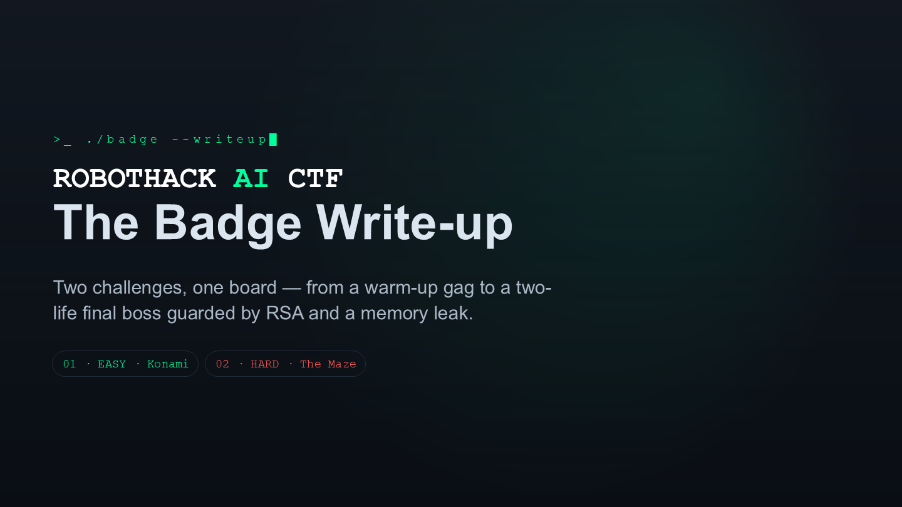

---

## Agenda — Two challenges on one board

**CHALLENGE 01 · EASY — The Konami Code**
Almost a free point. Enter the code, get a QR flag — and unlock the hidden `m3mdump` command to pull the firmware.
→ *QR flag · firmware dump*

**CHALLENGE 02 · HARD — The Maze & The Boss**
Dump & reverse the firmware, then solve the maze algorithm to reach the final boss — and beat its two lives: break the RSA layer and exploit an OOB memory-disclosure vulnerability to leak the cipher key.
→ *firmware RE · maze · RSA · leak*

> The board ships two flags. The first hands you a hidden command. The second is where the real work is.

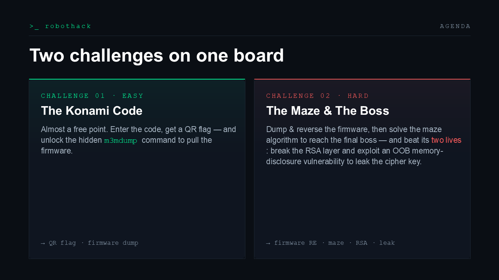

---

# 01 · `EASY` — The Konami Code

```
↑ ↑ ↓ ↓ ← → ← → B A
```

> **Hint** — The easiest challenge in this CTF. Enter the most famous cheat code in gaming history.

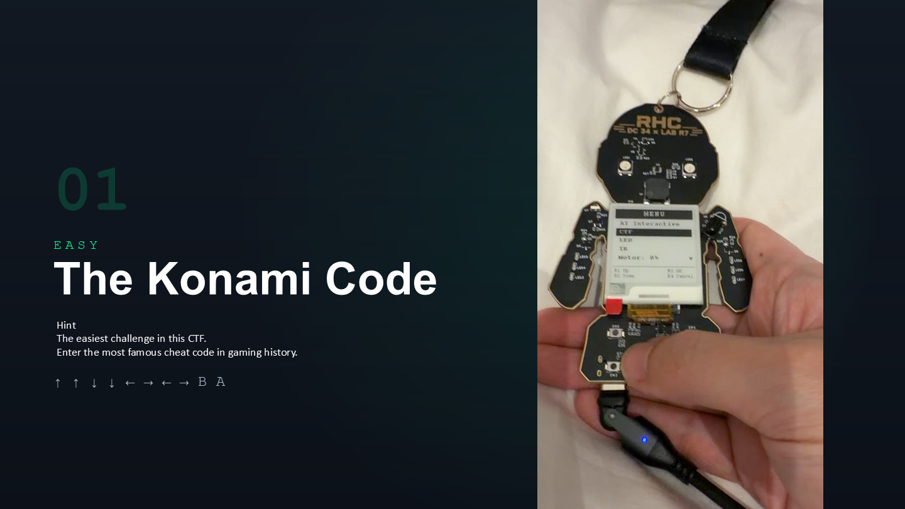

## Almost a free point

1. **On the badge**, enter the classic sequence on the buttons — `↑ ↑ ↓ ↓ ← → ← → B A`.
2. **The screen renders a QR code** — scan it to claim **Flag 01**.
3. **The flag also whispers a hidden command** for later.

*badge · display*

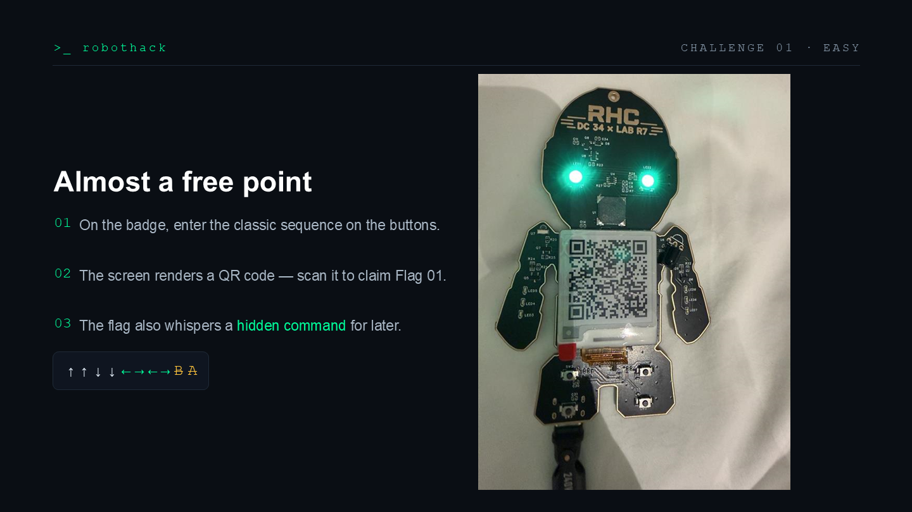

## Flag 01 · Captured 🚩

> **Congratulations!**
>
> ```
> RHC{ROBOT_CONTROL_UNLOCKED}
> ```
>
> **Secret command unlocked:** `m3mdump`

That hidden command is the real prize — it lets you dump the firmware straight off the board.

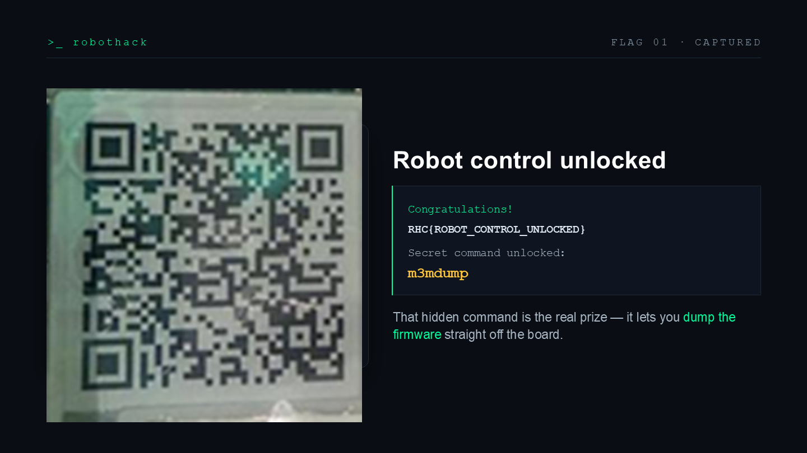

---

## 🛠 Tooling — `m3mdump`: dumping the firmware

The unlocked command reads device memory over UART. Dump the image, reverse it, and you have every constant challenge two throws at you.

| Step | Action | Detail |
|------|--------|--------|
| **01** | **Dump memory** | Read the flash image over serial with the newly unlocked command. |
| **02** | **Reverse it** | Recover the command table, the RSA constants, and the custom byte cipher. |

> ⚠️ **CATCH · One redaction** — `m3mdump` deliberately hides `0x1FFF6000` — **the cipher key**. We'll need another way in.

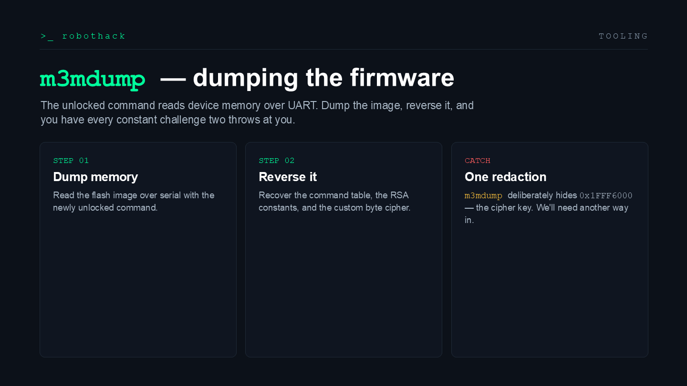

---

# 02 · `HARD` — The Maze & The Boss

> Two lives: first the maze, then the RSA gauntlet.

> **Hint** — There's a key hidden somewhere. Use every trick you know to read it — *Image it.*

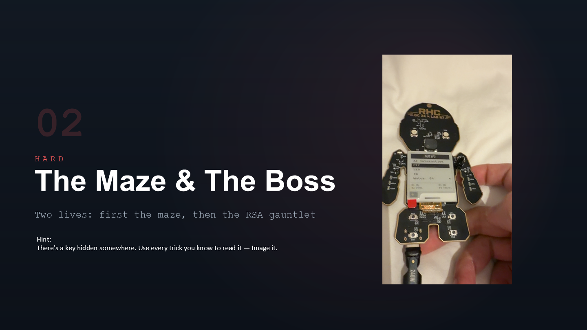

## Life 01 · The Maze — walk it by the rules

1. **Movement isn't free** — each step must follow the maze's algorithmic rule, not just open walls.
2. **Pick the correct direction** at every junction to trace the intended path.
3. **Reach the exit** and the badge renders the Flag 02 QR — the door to the boss.

> The maze isn't brute force — moves have to follow a specific algorithmic rule. Get the traversal right and the badge renders the next QR.

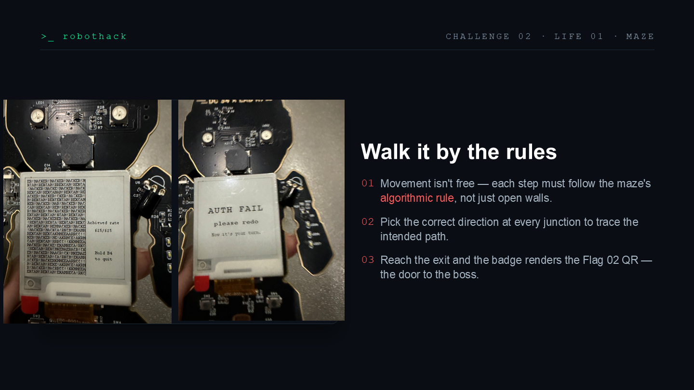

### Solution — the maze is a counter-clockwise spiral

Start dead center on **H**, then `↑ ← ↓ →` — spelling **`HACKER!`** outward until the grid fills.

- ⬛ **start · center H**
- ⬛ **spiral path** — `↑ ← ↓ →` · CCW

```c
bool authenticateMap() {          // 25 checks, path order (spiral)
    if (gmap[12][12] != 'H')      // ● start
    if (gmap[11][12] != 'A')      // ↑
    if (gmap[11][11] != 'C')      // ←
    if (gmap[12][11] != 'K')      // ↓
    if (gmap[13][11] != 'E')      // →
    if (gmap[13][12] != 'R')      // →
    if (gmap[13][13] != '!')      // →
    /* … HACKER! repeats outward … */
    if (gmap[0][0]   != '!')
    if (gmap[24][24] != 'R')
        return true;              // else return false
}
```

> The rule: start dead center on the **H** and fill the word `HACKER!` outward — up, left, down, right — a counter-clockwise spiral. The badge's `authenticateMap()` just verifies the letters sitting along that spiral. Nail the spiral and life one is down.

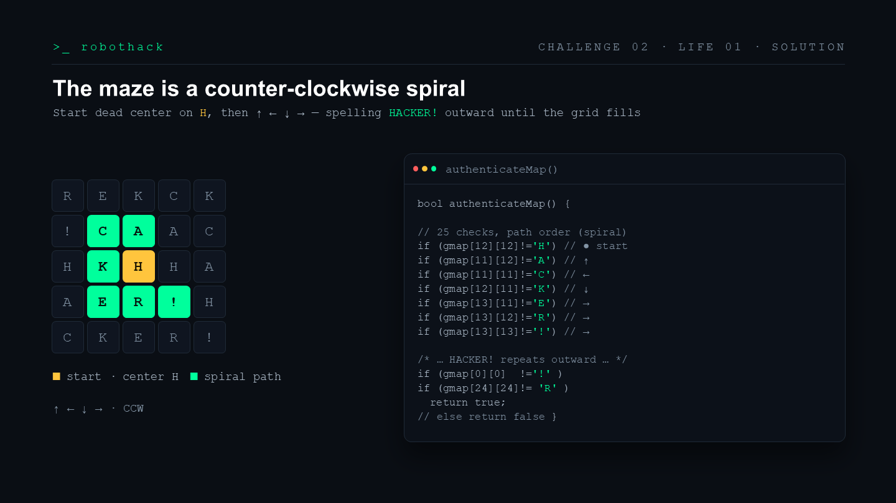

---

## Life 02 · The custom cipher — `rhcdecrypt`

The same routine unwraps the RSA base **and** decrypts the 5000-byte QR bitmap outright — no 625-cell entry.

```c
uint8_t chnbit(uint8_t c){ return (c >> 4) | (c << 4); }
uint8_t rol8(uint8_t c, unsigned n){ return (c << n) | (c >> (8 - n)); }
uint8_t ror8(uint8_t c, unsigned n){ return (c >> n) | (c << (8 - n)); }

void rhcdecrypt(const uint8_t* key, unsigned keylen,
                const uint8_t* input, uint8_t* output, int len) {
    int j = 0;
    for (int i = 0; i < len; i++) {
        uint8_t v = input[len - 1 - i];
        v ^= (uint8_t)(0x77 + i % 256);
        if (!(i % 2)) { v ^= key[j++ % keylen]; v = rol8(v, (2 + i) % 8); v = chnbit(v); }
        else          { v = ror8(v, (5 + i) % 8); v ^= key[j++ % keylen]; }
        output[i] = v;
    }
}
```

**Shortcut · decrypt the QR bitmap directly:**

```c
// key = maze map XOR leaked ROM dump, per byte
for (i = 0; i < 256; i++) key[i] = map[i] ^ dump_1FFF6000[i];
rhcdecrypt(key, 256, QR_ENC, out, 5000);   // → flag QR, no 625 cells
```

> This is the badge's real custom cipher, straight from the firmware. The same routine unwraps the RSA base for the boss — and, handed the key (the maze map XORed with the leaked ROM dump), it decrypts the 5000-byte QR bitmap outright, so you never have to hand-enter the 625 cells.

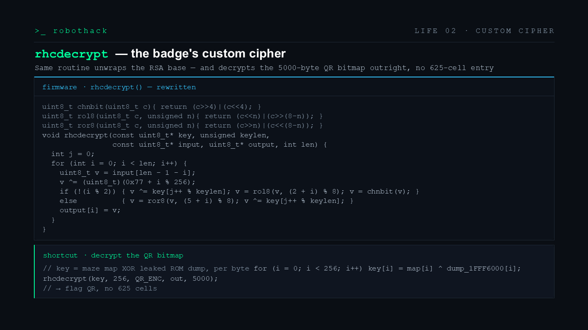

### Firmware constants — `map[25][25]`, `dump_1FFF6000[256]`, and the full routine

The full firmware listing: the `HACKER!`-spiral `map[25][25]`, the 256-byte ROM `dump_1FFF6000[]`, and `rhcdecrypt()` / `main()` wired together to write `output_decrypted.bin`.

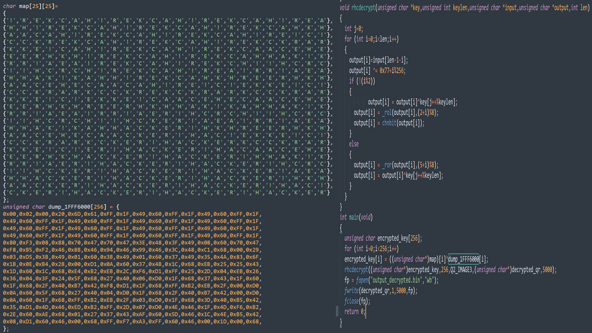

---

## Flag 02 · The Final Boss 👾

> **The final boss has two lives.**
>
> ```
> solve 641C0EF100BA72D1FA820A11B66551F9
> ```

You've already taken the boss's first life — the maze. This hex is a **128-bit RSA modulus `n`**; its second life is the RSA gauntlet: **leak the key, then break RSA.**

> Flag two isn't a win — it's a challenge. Two lives, and a modulus to solve.

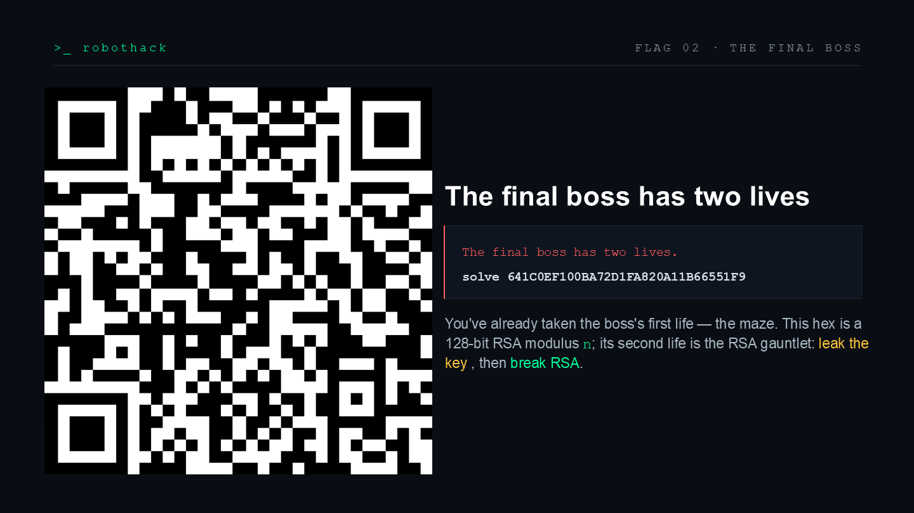

### The boss's two lives — overview

| | Life | What it takes |
|---|------|---------------|
| ✅ | **LIFE 01 · CLEARED — Solve the maze** | Trace the counter-clockwise spiral out from the center; the badge's `authenticateMap()` passes only on the correct path. |
| ➡️ | **LIFE 02 · THE GAUNTLET — The RSA chain** | Leak the cipher key via the OOB read, factor `n`, break RSA and invert the cipher — then the final flag drops. |

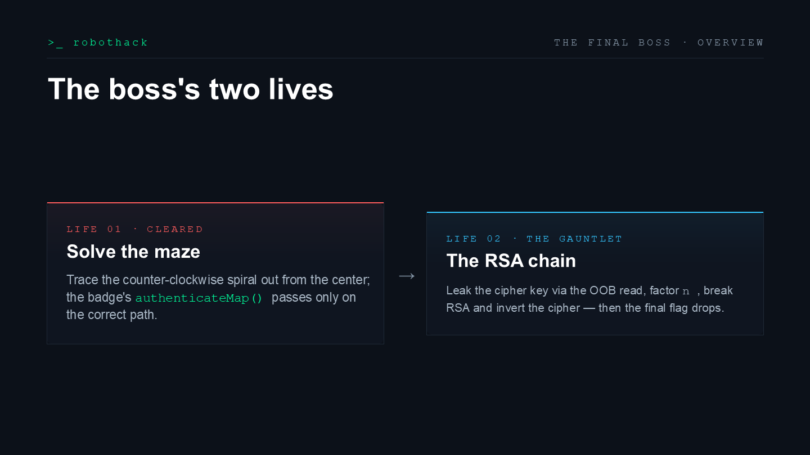

---

## Life 02 · Step 1 — Leaking the cipher key

**OOB read primitive → arbitrary memory disclosure**

- **PRIMITIVE** — `image peek` validates only the *upper* bound of `uiBuffer[]`, never the lower — an unauthenticated out-of-bounds read.
- **EXPLOIT** — A crafted negative offset (`SYSMEM − &uiBuffer`) redirects the read below the buffer into system memory.
- **LEAK** — Disclose 16 bytes at `0x1FFF6000` (bootloader ROM) to recover the key `m3mdump` deliberately redacts.

```python
# leak_key.py
SYSMEM = 0x1FFF6000    # ROM (key)
UIBUF  = 0x20000A24    # &uiBuffer

def leak(ser, n=16):
    off = SYSMEM - UIBUF                        # < 0
    r = cmd_json(ser, f"image peek {off} {n}")
    return bytes.fromhex(r["data"]["bytes"])

key = leak(ser)        # 16-byte key
```

> The trick: `image peek` only bounds-checks the top of `uiBuffer`. A negative offset reads below it. `off = SYSMEM - &uiBuffer` is negative, and out comes the key that `m3mdump` refused to show.

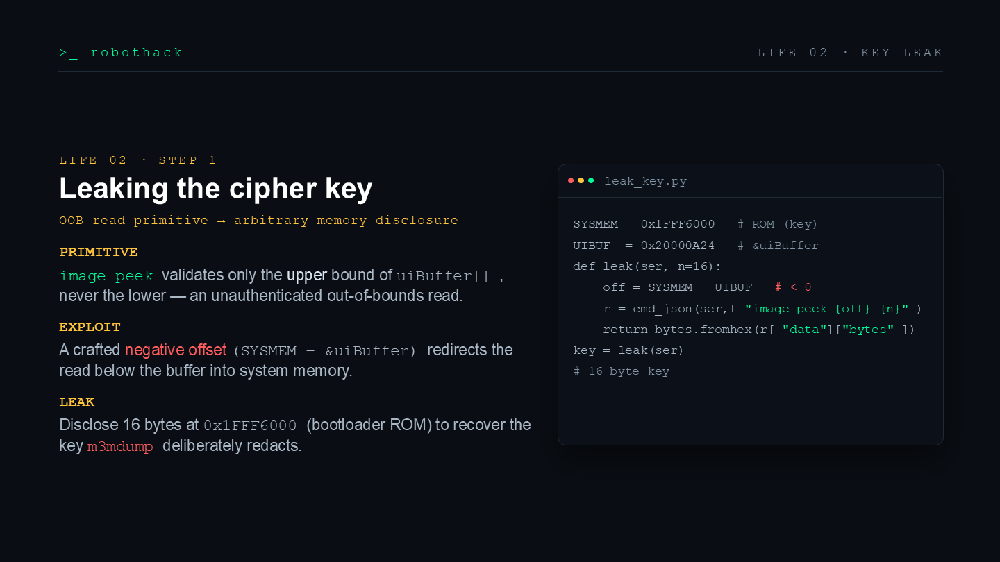

## Life 02 · Step 2 — Breaking the RSA layer

1. **Factor** the 128-bit modulus `n` → recover `d`.
2. **e-th root** of the target `"WARNING: Reverse"` → `base`.
3. **Invert** the custom byte cipher with the leaked key → `b`.

```python
def solve_rsa():
    p, q = factor(N)                  # 128-bit → easy
    d    = pow(E, -1, (p - 1) * (q - 1))
    base = pow(int(TARGET), d, N)
    b    = rhcdecrypt_inverse(key, base)
    # verify via firmware's exact steps
    assert rsa(rhcdecrypt(key, b)) == TARGET
```

> Now the math. `n` is only 128 bits, so factor it outright. Recover `d`, take the e-th root of the target string to get `base`, then run the custom cipher backwards with the leaked key to get `b`.

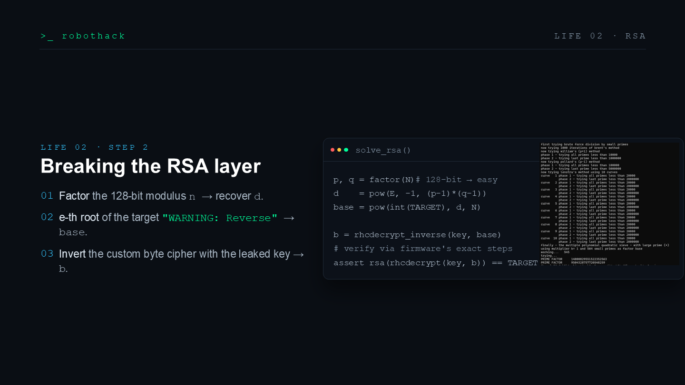

---

## 🏁 The finishing move

```console
$ solve 641C0EF100BA72D1FA820A11B66551F9 D55E153F8561C8A35B86C38990F5C2AF
```

### FLAG 🚩

```
RHC{did_u_rly_press_625_t1mes_huh}
```

> Run the solver: it leaks sysmem, factors `n` into `p` and `q`, derives `base` and `b`, then sends `solve` with the real `n` and `b` — `D55E153F8561C8A35B86C38990F5C2AF` — and the badge returns **SOLVED**.

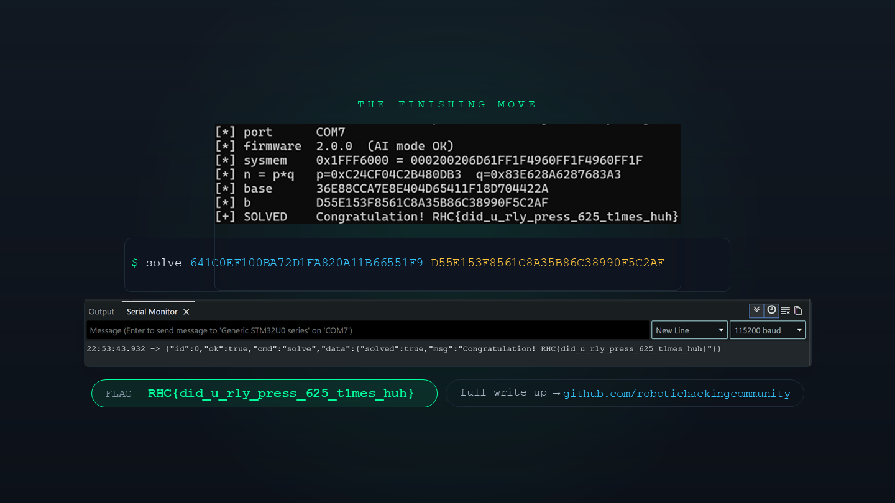

---

# Appendix · Solver Files (`solve/`)

The full solver scripts and firmware image live in the [`solve/`](solve/) folder, mirroring the attack chain above. How the three fit together:

```
m3mdump.py  ──dump──▶  flash_dump.bin  ──reverse──▶  constants / custom cipher
                                                         │
solve_exploit.py  ──OOB leak key + break RSA──▶  solve <n> <b>  ──▶  Flag
```

**Requirements**

```bash
pip install pyserial sympy
```

The badge must be in **AI Interactive** mode (top menu item, press B3); the firmware only services serial commands there.

**Quick start**

```bash
# 1) Dump the firmware (optional — flash_dump.bin is already included)
python solve/m3mdump.py                  # → flash_dump.bin

# 2) One-shot boss solver
python solve/solve_exploit.py            # auto-detect serial port
python solve/solve_exploit.py --port COM16
python solve/solve_exploit.py --uibuf 0x20000A24   # &uiBuffer for the flashed build (see .map)
```

### 🧰 `solve/m3mdump.py` — firmware memory dumper

Uses the hidden `m3mdump` serial command unlocked by Flag 01 to read MCU memory over UART and save it to a `.bin`.

- **Default range**: `0x08000000` + 128 KiB — the entire internal flash of the STM32U073CBT6.
- **Auto-detects** the CH340 / CH9102 USB-serial port (override with `--port COM7`).
- Each `m3mdump` is capped at 4096 bytes; the script chunks automatically, shows a progress bar, and stitches the result back together.
- **Reports the addresses the firmware deliberately redacts** (returned as `--` → `0x00`) — namely the cipher key at `0x1FFF6000`, exactly the target you later reach through the OOB read.
- **Prerequisite**: the badge must be in **AI Interactive** mode (top menu item, press B3); the firmware only services serial commands there.

```bash
# Default: 128 KiB from 0x08000000 → flash_dump.bin
python solve/m3mdump.py
# Custom range and output
python solve/m3mdump.py --base 0x08000000 --size 0x20000 --out flash.bin
# Dump 8 KiB of SRAM
python solve/m3mdump.py --base 0x20000000 --size 0x2000
```

Dependency: `pip install pyserial`

### 💾 `solve/flash_dump.bin` — the dumped firmware image

**Produced by `m3mdump.py` dumping the badge** — a 128 KiB STM32 internal-flash image (base address `0x08000000`). It opens with the ARM Cortex-M vector table (initial SP `0x2000A000`, reset handler in the `0x08000000` region). Reverse it to recover the command table, the RSA constants, and the custom byte cipher `rhcdecrypt` — every constant the boss above relies on comes from here. Note: the key at `0x1FFF6000` is blanked to `0x00` in this dump; you can only obtain it through the OOB read in `solve_exploit.py`.

### 🗝 `solve/solve_exploit.py` — the full boss solver (Flag 02)

A single script that runs the entire attack chain, matching Life 02 of the write-up:

1. Talk to the badge over UART while it is in AI Interactive mode.
2. **Leak the cipher key** — exploit the `image peek` OOB read (it only checks the *upper* bound of `uiBuffer[]`, never the lower) with a **negative offset** `SYSMEM − &uiBuffer` to read the system memory below the buffer at `0x1FFF6000` (STM32 bootloader ROM), recovering the 16-byte key `m3mdump` refuses to reveal.
3. **Break RSA** — factor the 128-bit modulus `n`, take the 65537-th root of the target string `"WARNING: Reverse"` to get `base`, then invert the custom cipher `rhcdecrypt` with the leaked key to recover the value `b` to submit; verified locally through the firmware's exact steps.
4. Send `solve <n> <b>` and read back the flag.

```bash
python solve/solve_exploit.py                 # auto-detect port, run the whole chain
python solve/solve_exploit.py --port COM16
python solve/solve_exploit.py --uibuf 0x20000A24   # &uiBuffer for the flashed build (see .map)
```

Dependencies: `pip install pyserial sympy`

> ⚠️ `--uibuf` must match the `&uiBuffer` of the flashed firmware; if the firmware changes, read the correct address from the linker `.map` and pass it in. The script bundles both the forward and inverse `rhcdecrypt`, byte-for-byte identical to the firmware.
